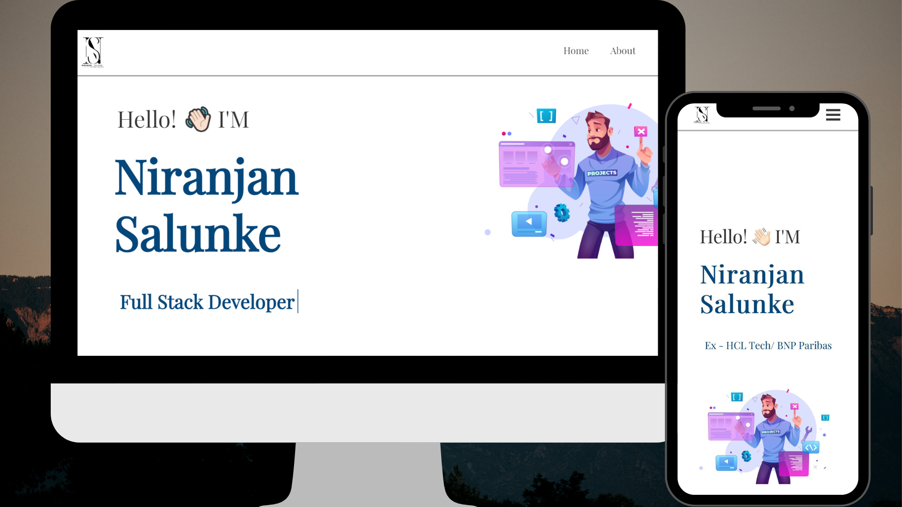

<h2 align="center">
  Niranjan Salunke | LinkedIn 
  <a href="https://www.linkedin.com/in/niranjan-salunke/" target="_blank">Niranjan Salunke</a>
</h2>

  

 

Thanks to <a href="https://github.com/rahuljha4171">Rahul Jha</a> .
You can fork this repo to modify and make changes according to your need. Please give me proper credit by linking back to [Rahuljha4171](https://github.com/rahuljha4171/Portfolio-Website). Thanks in Advance😍!

## Built With

This project is built using these technologies.

- React.js
- CSS3
- VsCode
- Vercel

## Features

**Multi-Page Layout**

**Styled with React-Bootstrap and Css**

**Fully Responsive**

**Dark and Light Theme**

## Getting Started

Clone this repository. You will need `node.js` and `git` installed globally on your machine.

## 🛠 Installation and Setup Instructions

1. Installation: `npm install`

2. In the project directory, you can run: `npm start`

Runs the app in the development mode.\
Open [http://localhost:3000](http://localhost:3000) to view it in the browser.
The page will reload if you make edits.

## Usage Instructions

Open the project folder and Navigate to `/src/components/`.  
You will find all the components used and you can edit your information accordingly.

Give a ⭐ if you like this website!

